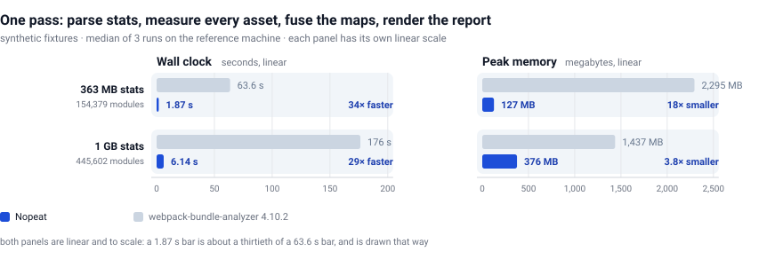
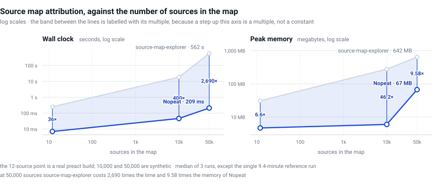
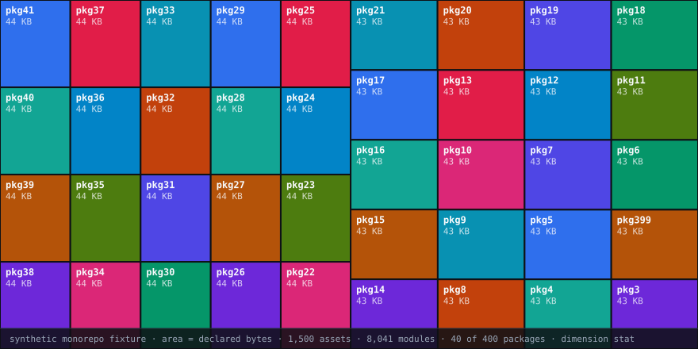

<div align="center">


# Nopeat

**一个分析器，读取所有打包器的产物。** 依赖图来自 `stats.json`，真实字节归因来自 source map，
esbuild metafile，或者一个普通的 `dist/` 目录——合并成同一张图，内存占用只占对方的一小部分。

Nopeat 是芬兰语 *nopea*（"快"）的复数形式，发音近似 "NO-peh-aht"。

[](https://github.com/Nopeat/Nopeat/actions/workflows/ci.yml)
[](#安装)
[](https://doc.rust-lang.org/stable/notes.html)
[](LICENSE-MIT)

[English](README.en.md) · **中文** · [日本語](README.ja.md) · [Deutsch](README.de.md)

</div>

<p align="center">
  <a href="#问题">问题</a> ·
  <a href="#实测数据">实测数据</a> ·
  <a href="#幽灵代码与隐藏代码">幽灵与隐藏代码</a> ·
  <a href="#安装">安装</a> ·
  <a href="#当前状态">诚实的状态</a> ·
  <a href="#为什么这样做">为什么这样做</a>
</p>

---

## Why it is fast

Three decisions, each with a number behind it. The full table is in
[`CHANGELOG.md`](CHANGELOG.md); the measurements are reproducible from
[`bench/results/`](bench/results/).

**It streams instead of building a parse tree.** The obvious implementation
deserialises `stats.json` into a `serde_json::Value` and then walks it. That value
is a tree of boxed maps and owned strings, and on the 1 GB fixture it cost about
550 MB before any analysis started. Modules enter the graph one at a time instead,
so the document is never resident. Peak stays at 376 MB against a 400 MB ceiling.

**It builds an index instead of scanning.** Matching each module to its source was
O(modules × sources): 2.5 billion comparisons, 73.8 seconds on the fused
benchmark. A suffix index built once per asset turns the lookup into a hash, and
the same benchmark drops to 4.94 seconds. A property test asserts the index and the
original scan agree on every awkward case, so it is the same rule with a lookup
table rather than a second implementation.

**It shares what repeats.** A large build has hundreds of thousands of modules and
a few hundred packages. Package references are interned, so every module in a
package points at one allocation. On the 1 GB fixture that was worth about 82 MB.

There is no `unsafe` in any of it — `#![forbid(unsafe_code)]` is enforced by the
compiler, so there is no hand-written SIMD and no unchecked indexing. The
bottleneck was never arithmetic. It was allocation and IO.

## It finds code nothing else can account for

The join between a bundler's module graph and a source map is the part no existing
tool does. `webpack-bundle-analyzer` reads a graph, `source-map-explorer` reads a
map, and neither reconciles them.

Nopeat does, and whatever fails to reconcile is reported rather than hidden:

- **Ghost code** — declared by the bundler, attributed to no source file. Code that
  will ship to production and that no one on the team has traced back.
- **Hidden code** — bytes in the bundle that map back to no module. Minifier
  output, injected polyfills, the bundler's own runtime.

Both show up in the report as first-class rows, not as a footnote. Ghost code
needs a declared graph to be defined against, so with a bare build folder it is
reported as undetectable (`NPT0051`) instead of as a reassuring zero.

## 支持的打包器

| 打包器 | Nopeat 读什么 | 需要 `dist/` + `*.map`？ | 幽灵代码检测 |
|---|---|---|---|
| **webpack** 4 / 5 | `stats.json` | 不需要 | 支持 |
| **rspack** | `stats.json`（同一套 schema） | 不需要 | 支持 |
| **esbuild** | `metafile.json`，或直接读产物目录 | 用 `--metafile` 就不需要 | 用 `--metafile` 时支持 |
| **Vite** | 产物目录和它的 source map | 需要 | 需要开启 `--stats` 输出 |
| **Rollup** | 产物目录和它的 source map | 需要 | 需要 `stats.json` |
| **Parcel** | 产物目录和它的 source map | 需要 | 需要 `stats.json` |
| **tsup / esbuild 封装** | 产物目录和它的 source map | 需要 | 需要 `stats.json` |
| **Angular / Next.js / Nuxt / SvelteKit** | 它们产出的东西，也就是 webpack 或 vite 的产物 | 视情况 | 视情况 |

两种输入形态，区别很重要：

- **打包器图**（`stats.json`、`metafile.json`）给出依赖结构**和**声明的体积。
  只有这一种形态能做**幽灵代码**检测——因为"幽灵"的定义就是"打包器声明并输出、
  但没有任何 source map 解释得了的模块"。
- **只有产物**（一个带 `*.map` 的 `dist/` 目录）给出实测文件体积和按 source 的归因，
  这已经是 vite、rollup、parcel、tsup 默认给你的全部信息。这里的尺寸是精确的，
  因为是量出来的而不是估算的。幽灵检测会明说自己不可用，而不是报一个 0：
## 问题

你把体积分析工具指向一次构建，它要么内存爆掉，要么要跑一分钟，最后给你一张你根本没法行动的图片。
`webpack-bundle-analyzer` 把整个 `stats.json` 塞进 JS 堆：在一次 363 MB 的构建上，那是
**63.6 秒和 2.3 GB**，就为了回答"这玩意儿多大？"而且就算画完 treemap，它仍然无法告诉你那两件
真正让你掏钱的事——见[下面](#幽灵代码与隐藏代码)。

Nopeat 流式读取 stats 文件、测量真实产出的字节、把 source map join 到模块图上，
并且明确告诉你它用的是哪一个维度。

## 实测数据

完整流程——解析 stats、测量磁盘上每个 asset、融合 source map、生成报告。
合成 fixture，3 次取中位数，参考机器。

<picture>
  <source media="(prefers-color-scheme: dark)" srcset="docs/assets/chart-pipeline-dark.svg">
  
</picture>

| 输入 | Nopeat | webpack-bundle-analyzer | 倍数 |
|---|---|---|---|
| 363 MB `stats.json`，154,379 模块 | **1.87 s / 127 MB** | 63.6 s / 2,295 MB | **快 34 倍，小 18 倍** |
| 1 GB `stats.json`，445,602 模块 | **6.14 s / 376 MB** | 176.3 s / 1,437 MB | 快 29 倍，小 3.8 倍 |

source map 归因，横轴是 map 里的 source 数量。这正是让大 map 在参考工具里不可用的超线性：
**数据量 5 倍，它的时间变成 30 倍**，而我们这条线基本是平的。

<picture>
  <source media="(prefers-color-scheme: dark)" srcset="docs/assets/chart-source-maps-dark.svg">
  
</picture>

这里每个数字都能用 `bench/` 里的 harness 复现，原始记录已入库：
[`docs/assets/charts-data.json`](docs/assets/charts-data.json) 列出每个数字的出处，
[证据日志](ARCHITECTURE.md) 里有对应的测量场次。

## 幽灵代码与隐藏代码

两个参考工具都告诉不了你的东西。这也是这个项目真正新的部分。

- **幽灵代码（ghost code）**——打包器声明并打包了，但**没有任何 source map 解释得了**的模块。
  要么是 tree-shaking 漏掉了，要么那个 asset 根本没带 map。它在你的产物里，却不在任何人的体积报告里。
- **隐藏代码（hidden code）**——生成的字节**不属于任何模块**：内联的代码片段、`eval`、打包器注入的
  polyfill。它在你的产物里，却不属于任何模块的体积。

Nopeat 把每个 source 的字节份额折算回产生它的模块，剩下无法对账的部分变成诊断信息，而
不是被四舍五入掉：


而当它确实对不上账，它会说明是哪个方向不对。下面是两个 asset 里只有一个带 map 的构建：

```
$ nopeat ./dist
dist  ·  22 modules  ·  2 assets  ·  11 packages  ·  ingest 4 ms  ·  total 6 ms  ·  dimension parsed
fusion: 1 map(s) · coverage 47% · 0/22 modules attributed · 22 ghost (83 KB of declared) · 3 hidden source(s) (39 KB)
```

注意是 `dimension parsed`，不是 `attributed`：一半构建没有 map，于是 ground truth 维度被撤回，
报告在第一行就说明这件事。一个把两者悄悄平均掉的工具，报出来的数字不属于任何一次测量。

归因依据是真实 join key 上的最长路径后缀匹配（见
[`unified-graph.md`](docs/schema/unified-graph.md)），**从不使用内容哈希**；
修正后的尺寸之和会与 asset 总大小做不变量校验，不通过就大声报错（`NPT0042`），
而不是悄悄取整。

## 报告

<p align="center">
  
</p>

<sub>合成 fixture 中 400 个 package 里最大的 40 个：1,500 个 asset、8,041 个模块，
尺寸为 bundler 声明的值。图片由 `bench/harness/render-treemap.py` 从工具自己的 graph
payload 绘制，不是截图，因此标签就是工具的输出；CI 会重新生成，并在出现差异时失败。
HTML 报告另外还有搜索、三种分组维度、按模块下钻、明暗主题，并且不发起任何网络请求。</sub>

## 安装

**尚未发布。** npm 上没有 `nopeat`，crates.io 上也没有可安装的 crate，所以
`npx nopeat` 和 `cargo install nopeat-cli` 今天都不可用，本 README 不提供它们。
请从源码构建：

```bash
# Linux and macOS
curl -L -o nopeat.tar.gz \
  https://github.com/nopeat/nopeat/releases/download/v2.1.1/nopeat-2.1.0-x86_64-unknown-linux-gnu.tar.gz
tar -xzf nopeat.tar.gz

# Windows
curl -L -o nopeat.zip \
  https://github.com/nopeat/nopeat/releases/download/v2.1.1/nopeat-2.1.0-x86_64-pc-windows-msvc.zip

# or from source
git clone https://github.com/nopeat/nopeat.git
cd nopeat
cargo build --release
./target/release/nopeat ./dist
```

```bash
sha256sum -c checksums.txt
```

```bash
git clone https://github.com/Nopeat/Nopeat.git
cd nopeat
cargo build --release
./target/release/nopeat ./dist
```

推送 `v*` tag 之后，发布流程按 `ARCHITECTURE.md release-and-ci.md` §2 的顺序执行：先把二进制
传到 GitHub releases，再把 `nopeat-core` 发到 crates.io，最后才发 npm wrapper
—— npm 包名是最稀缺的资源，留到最后使用。npm 与 crates.io 的徽章以及两条安装命令会在
填写 `repo-links.json` 的那次提交里回来。npm wrapper 会在写入或执行任何东西之前校验
`checksums.txt`。

## 使用

```bash
nopeat ./dist                      # 目录：stats + assets + *.map
nopeat ./dist/stats.json           # 单个 stats 文件
nopeat ./dist/metafile.json        # esbuild metafile

nopeat ./dist --budget nopeat.config.json   # 超限退出码 1
nopeat ./dist --mode json > sizes.json          # 给 CI 或 BI 用
nopeat ./dist --csv sizes.csv
nopeat ./dist/map.js.map --bench-map            # 只跑归因，并计时
```

```jsonc
// nopeat.config.json
{
  "limits": [
    { "scope": "total",   "max": 1500000 },
    { "scope": "chunk",   "match": "vendor", "max": 800000 },
    { "scope": "package", "match": "moment", "max": 250000, "dimension": "gzip" }
  ]
}
```

<details>
<summary>退出码——属于契约的一部分，因为 CI 门禁就是建立在它上面的</summary>

| 退出码 | 含义 |
|---|---|
| 0 | 分析完成，且所有预算都通过 |
| 1 | 分析完成，但有预算被突破（`NPT0040`） |
| 2 | 命令行参数错误 |
| 3 | 输入不可读，或某条预算规则匹配不到任何对象 |

匹配不到任何对象的预算规则**故意**算错误：规则里的笔误绝不该悄悄让 CI 通过。

</details>

## 当前状态

1.0 之前，下面这张表是诚实的版本。没测量的东西就写没测量。

| 领域 | 状态 |
|---|---|
| stats 摄取、尺寸归因、source map、融合、报告、预算、JSON/CSV | 已实现、已测量、CI 门禁 |
| 1 GB 摄取的墙钟时间 | **未达标**：4.40 s，目标 3 s（内存 350 MB，很宽裕） |
| 报告首屏渲染 / 30 fps | **未验证**——CI 里没有浏览器；改为测量 154,379 模块下 1.56 MB、1.27 s |
| WASM 构建、WebGL 渲染器 | 尚未开始 |
| Linux / macOS runner | 没有平台相关的代码分支；CI 只在 Windows 上运行 |
| tests | 82 Rust, 4 npm, 1,018 generated layout cases | 全绿 |
| coverage | 覆盖率 82.19% of lines, against a 70% floor |

唯一那个未达标项，在 [CHANGELOG](CHANGELOG.md) 里写明了原因：瓶颈是 `serde_json` 的 DOM 游标
在 445,602 个元素的模块数组上。

## 为什么这样做

每一个设计决策都来自一次测量，而不是偏好。

| 决策 | 依据 |
|---|---|
| 流式 JSON，不用 `simd-json` | `simd-json` 需要把整个文档读进内存——而那正是我们要拆掉的天花板（[ADR-0001](ARCHITECTURE.md)） |
| 自研 HTML 报告，不 vendor 别人的 viewer | 不受我们控制的 viewer 无法展示融合数据，除非 fork；fork 之后这份 UI 就归我们维护了（[ADR-0002](ARCHITECTURE.md)） |
| 尺寸与 gzip 用 rayon 并行 | 25,600 个 asset：串行 2,177 ms → **342 ms**（6.4 倍）；解析从来不是瓶颈 |
| join 用后缀索引 | 每个模块都扫一遍全部 source 是 25 亿次比较；换成索引后 73.8 s → 4.9 s |
| 计数精确、列表有界 | 每个未映射模块存一条记录，为一个文档里写着"summary"的字段花掉 47 MB |
| 用性质测试而不是 fixture | 抓到两个真实缺陷——模块体积**从不缩小**，以及越界的 source index 让归因静默消失——仓库里任何 fixture 都看不见 |

### 我们没有做什么，以及为什么

| 放弃的方案 | 原因 |
|---|---|
| vendor WBA 的 viewer | 不 fork 就无法展示融合数据；fork 之后这份 UI 就归我们维护了 |
| `simd-json` | 需要把文档读进内存，而这正是问题本身 |
| Phase 1 用 WebGL treemap | 10k 个节点 Canvas 2D 足够；渲染器替换是 Phase 2 的事，放在稳定 payload 之后 |
| 通用的构建工具 | 实测的痛点是内存天花板、逐项进程，或超线性算法。这三条这个项目都占。 |

## 文档

- [产品需求](ARCHITECTURE.md) · [证据日志](ARCHITECTURE.md) · [架构](ARCHITECTURE.md)
- [基准与目标](docs/schema/bench-spec.md) · [一致性与测试](docs/schema/bench-spec.md) · [发布与 CI](CONTRIBUTING.md)
- [契约](docs/schema/unified-graph.md)——payload schema、CLI 接口、基准协议、i18n 规则、归属
- [ADR](ARCHITECTURE.md)  · [风险清单](docs/schema/bench-spec.md) · [路线图](docs/schema/bench-spec.md)

> 完整的中文文档正在翻译中。英文文档是**规范源**；`node bench/harness/check-i18n.mjs`
> 会检查四种语言是否漂移。

## 参与贡献

每一次改动都要么附带一次测量，要么给出"为什么这次不需要测量"的论证。详见
[CONTRIBUTING.md](CONTRIBUTING.md)；门禁是 `cargo test`、`clippy -D warnings`（含 pedantic）、
`cargo fmt`、82% 覆盖率下限、与 `webpack-bundle-analyzer` 的一致性比对，以及四语文档检查。
[行为准则](CODE_OF_CONDUCT.md) · [安全策略](SECURITY.md)

## 许可证

MIT（[LICENSE-MIT](LICENSE-MIT)）或 Apache-2.0（[LICENSE-APACHE](LICENSE-APACHE)），由你选择。

---

<div align="center">
  <sub>
    公开构建中。欢迎在
    <a href="https://github.com/Nopeat/Nopeat/issues">issues</a>
    里对数字提出质疑——这是让一个基准测试保持意义的唯一办法。
  </sub>
</div>
